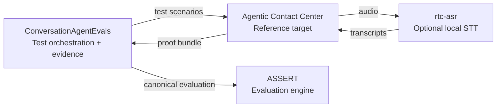

# rtc-asr

`rtc-asr` is a lightweight FastAPI service for benchmarking and serving ASR over REST or WebSocket. This can be used for real time and on demand caption generation or transcription. It is optimized for warmed, local or on-device inference paths, especially low-power and average CPU, Apple Silicon, and small accelerator setups. The core contract stays stable while you swap ASR backends underneath it, which makes it useful as a thin speech layer in RTC stacks, voice agents, and local benchmarking.

An open-source project from [WebRTC.ventures](https://webrtc.ventures/).

The service currently supports `faster-whisper`, `qwen-asr`, `parakeet`, `parakeet-mlx`, `parakeet-nemo`, and experimental `voxtral` backends behind the same API surface.


## WebRTC.ventures voice-agent reliability projects

This project is part of the [WebRTC.ventures](https://webrtc.ventures/) open-source voice-agent reliability initiative. The projects remain independently usable and integrate through explicit adapters and evidence contracts:

- [ConversationAgentEvals](https://github.com/agonza1/ConversationAgentEvals) orchestrates tests, normalizes evidence, and reports regressions.
- [Agentic Contact Center](https://github.com/agonza1/agentic-contact-center) is the reference voice-agent target and demonstration.
- [rtc-asr](https://github.com/agonza1/rtc-asr) provides optional local streaming speech-to-text and reproducible ASR benchmarks.
- [ASSERT](https://github.com/responsibleai/ASSERT) remains the upstream evaluation engine.



## What It Ships Today

- `GET /health` for liveness plus active backend/model metadata
- `GET /ready` for preload status and degraded startup reporting
- `GET /api/models` for backend/model capability metadata that RTC clients can inspect
- `POST /api/transcribe` for one-shot base64 audio requests
- `POST /api/transcribe/file` for uploaded file transcription
- `ws://.../v1/stt/stream` for Local STT v1 JSON-control plus binary-PCM websocket streaming (recommended)
- `ws://.../ws/stream` for the older buffered websocket transcription path with `ready`, `partial`, `final`, `canceled`, and `error` events
- Shared client helpers in `src/rtc_client.py` and `src/streaming.py`
- A browser Pipecat demo at `http://127.0.0.1:8090/rtc-asr` when you run the companion demo service

## Quick Start

### Local Python

```bash
python3 -m venv .venv
. .venv/bin/activate
pip install -U pip
pip install -r requirements.txt
uvicorn src.main:app --host 0.0.0.0 --port 8080 --reload
```

The default local dependency set is pinned for the repo's `qwen-asr` stack. If you want to run the Hugging Face Parakeet path outside Docker Compose, upgrade that local runtime first:

```bash
pip install --upgrade --no-deps huggingface-hub==1.18.0 transformers==5.10.2
```

### Docker Compose

```bash
docker compose build
docker compose up -d
docker compose ps
docker compose logs -f
```

That Compose stack starts the main ASR service on `http://127.0.0.1:8080` and the browser Pipecat demo on `http://127.0.0.1:8090/rtc-asr`. Use `docker compose up -d --build` to run both services locally.

## Best Low-Power Quick Start

For the most useful default CPU baseline, start with:

```env
ASR_BACKEND=faster-whisper
ASR_MODEL_SIZE=base.en
ASR_DEVICE=cpu
ASR_COMPUTE_TYPE=int8
```

If you only need a smoke-test edge lane, `tiny.en` is a reasonable alternate quick-start. Use `base.en` for the more representative low-power benchmark lane.

## Operator Defaults

```env
HOST=0.0.0.0
PORT=8080
SAMPLE_RATE=16000
STREAM_MAX_BUFFER_BYTES=1048576
LOCAL_STT_ENABLE_PCM16_FAST_PATH=true
LOCAL_STT_REQUIRE_TARGET_SAMPLE_RATE=true
LOCAL_STT_TARGET_SAMPLE_RATE=16000
ASR_BACKEND=faster-whisper
ASR_MODEL_SIZE=base.en
ASR_DEVICE=cpu
ASR_COMPUTE_TYPE=int8
ASR_PRELOAD_MODEL=false
ASR_FAIL_FAST=false
```

Backend-specific variables are available for Qwen, Parakeet, NeMo Parakeet, and experimental Voxtral. Set `ASR_VOXTRAL_MAX_NEW_TOKENS` to cap realtime decode length for predictable latency on the Transformers path, and optionally set `ASR_VOXTRAL_ATTN_IMPLEMENTATION` when a local Transformers/Torch stack needs a specific attention backend such as `sdpa` or `flash_attention_2`. Voxtral accepts `ASR_BACKEND=voxtral`, `voxtral-realtime`, `voxtral-mini`, or `voxtral-mini-4b` for the Mini 4B Transformers adapter, and `ASR_BACKEND=voxtral-mlx`, `voxtral-realtime-mlx`, `voxtral-mini-mlx`, or `voxtral-mini-4b-mlx` for the Apple Silicon MLX 4-bit adapter. Set `ASR_VOXTRAL_TRANSCRIPTION_DELAY_MS=480` for the MLX model-card default latency/accuracy balance. Set `ASR_PRELOAD_MODEL=true` when you want startup-time backend validation instead of lazy first-use loading. See [API Reference](./docs/api-reference.md) and [Troubleshooting](./docs/troubleshooting.md) for backend-specific behavior.

If `ASR_DEVICE` is unset but `CUDA_VISIBLE_DEVICES` exposes a GPU, the service defaults to `cuda`. Legacy aliases `MODEL_NAME` and `AUDIO_SAMPLE_RATE` are still accepted for compatibility.

## Recommended Low-Power Profiles

| Profile | Target | Backend | Model | Notes |
| --- | --- | --- | --- | --- |
| Tiny CPU | Raspberry Pi / mini PC | `faster-whisper` | `tiny.en` `int8` | Best smoke test, lowest accuracy |
| Practical CPU | Mac Mini / N100 / laptop | `faster-whisper` or `parakeet-nemo` | `base.en` `int8` or `nvidia/parakeet-tdt_ctc-110m` | Good default benchmark lane; 110M Parakeet is the higher-quality CPU comparison |
| Apple Silicon | M-series Mac | `parakeet-mlx` or `voxtral-mlx` | `mlx-community/parakeet-tdt_ctc-110m`, `mlx-community/parakeet-tdt-0.6b-v3`, or `mlx-community/Voxtral-Mini-4B-Realtime-2602-4bit` | Strong warmed latency and power tradeoff; Voxtral MLX is the 4-bit realtime comparison lane |
| Not low-power | Large CPU or accelerator comparison lane | `qwen-asr`, experimental `voxtral`, Canary Flash, or larger Parakeet variants | `Qwen/Qwen3-ASR-0.6B`, `mistralai/Voxtral-Mini-4B-Realtime-2602`, `nvidia/canary-1b-flash`, or `nvidia/parakeet-tdt-0.6b-v3` | Useful comparison, not the default edge path |

Current checked-in benchmarks make the Apple Silicon story especially strong for the warmed `parakeet-mlx-service-110m` lane. See [Benchmarks](./docs/benchmarks.md) for the latest artifact-backed numbers.

## Streaming Contract

Prefer `ws://localhost:8080/v1/stt/stream` for new integrations. The Local STT v1 contract is the primary streaming surface for this repo, and [`docs/local-stt-v1.md`](./docs/local-stt-v1.md) is the canonical integration guide.

Use the legacy `ws://localhost:8080/ws/stream` route only when you need backward compatibility with the older buffered websocket API or when comparing against historical benchmark artifacts. That route remains useful as a local buffered-websocket stress harness, but it is not the contract we want new clients to target.

For the full Local STT v1 handshake, message types, and examples, start with [`docs/local-stt-v1.md`](./docs/local-stt-v1.md). At a high level:

1. Open `ws://localhost:8080/v1/stt/stream`.
2. Send the Local STT v1 control message that configures the stream.
3. Send mono PCM16 audio as binary websocket frames.
4. Read interim and final transcript events from the server.
5. End the turn using the Local STT v1 finalize/close flow described in the spec.

The legacy `/ws/stream` path is buffered websocket ASR rather than a frame-synchronous decoder contract. Partial transcripts are generated from buffered windows and backend behavior varies. A fast `partial` event there does not always mean the backend is a true streaming ASR model.

Example start event:

```json
{
  "type": "start",
  "language": "en",
  "sample_rate": 16000,
  "partial_interval_chunks": 1,
  "partial_window_seconds": 1.0,
  "max_buffer_seconds": 10.0
}
```

Example ready event:

```json
{
  "type": "ready",
  "stream_id": 1,
  "backend": "faster-whisper",
  "model": "base.en",
  "language": "en",
  "sample_rate": 16000,
  "partial_interval_chunks": 1,
  "max_buffer_bytes": 1048576
}
```

After a `final` event, the legacy `/ws/stream` socket stays open so the client can start the next utterance without reconnecting.

## Audio Assumptions

- Preferred transport is mono PCM16 chunks over binary websocket frames.
- JSON base64 audio events are still supported for simpler clients.
- A `sample_rate` must be supplied in the `start` event for raw PCM streams.
- Start with `100` to `200` ms PCM16 chunks for service benchmarking.
- Use `20` ms only when bridging from RTC audio frames, and aggregate before websocket transmission unless you are explicitly measuring per-frame overhead.
- The service decodes and resamples once through the shared audio processor before handing audio to the configured backend.
- `partial_window_seconds` and `max_buffer_seconds` let clients cap how much buffered audio feeds partials and finals.

## RTC Edge Pattern

Use WebRTC, RTP, or Opus only at the media edge, then forward normalized raw audio into `rtc-asr` over a simple websocket. That keeps `rtc-asr` focused on ASR benchmarking and serving instead of turning it into a media server.

This is also why the repo ships a small Local STT service and Pipecat adapter instead of relying only on existing Pipecat STT plugins. Pipecat already gives voice apps a strong media and pipeline layer, and its provider plugins are a good fit when the ASR runtime is an external service. `rtc-asr` covers a different job: keep local ASR models warm, expose the same REST/websocket contract across backends, capture reproducible latency artifacts, and let Pipecat talk to that sidecar through a minimal PCM protocol. That separation makes local CPU, Apple Silicon, and accelerator experiments comparable without baking one Pipecat release or one hosted provider schema into the ASR service.

```text
Browser / mobile mic
  -> WebRTC / RTP / Opus
Pipecat transport
  -> decoded PCM frames, usually ~20 ms
Chunk aggregator
  -> binary PCM16 websocket frame every 80-160 ms
rtc-asr /v1/stt/stream
  -> partial/final transcript events
Voice agent pipeline
```

Why aggregate `20` ms frames before sending them to `rtc-asr`? Sending every RTC frame directly is responsive in theory, but it creates unnecessary websocket and CPU overhead while giving the backend very little audio context per partial. Aggregating roughly `4` to `8` RTC frames into `80` to `160` ms websocket chunks keeps transcription responsive, produces steadier partials, maps cleanly from RTC frame cadence, and avoids excessive message rates on smaller devices. Larger chunks can be useful for benchmarking, but they start to trade away live interaction latency.

## Warm-Up And Keep-Warm

Most ASR backends have a cold-start penalty from model load, graph compilation, and first-request cache setup. That means the very first transcription can be much slower than steady-state traffic, especially for MLX, MPS, and larger transformer-based models.

Best practice for production-style serving:

- Set `ASR_PRELOAD_MODEL=true` so model load happens at startup instead of on the first live request.
- Gate traffic on `GET /ready` rather than only `GET /health` so callers wait for preload to finish.
- Send one short warm-up transcription after startup or deploy before measuring latency or shifting traffic.
- Keep the process resident and reuse it across requests; avoid one-shot CLI-style invocations if you care about real serving latency.
- If a platform idles containers or workers aggressively, use a small synthetic keep-warm request on a cadence that matches that platform's eviction behavior.

In this repo, checked-in service benchmarks use warmed server flows for apples-to-apples latency comparisons. Cold CLI preview artifacts are useful for exploration, but they should not be treated as the steady-state serving baseline.

## Benchmark Methodology

For low-power claims, latency alone is not enough. Recommended benchmark fields:

- device, CPU, and RAM
- accelerator type: none, MPS, MLX, CUDA, or NPU
- wall latency: REST mean and P95, ASR TTFB / first partial, and final
- realtime factor (`RTF`)
- peak RSS memory
- CPU utilization
- package power when available
- sustained thermal behavior over `5` to `10` minutes
- transcript churn across partial updates

The checked-in artifacts already cover warmed service latency, ASR TTFB / first partial responsiveness, `RTF`, Local STT interim transcript churn, process RSS, and CPU utilization. Use `--package-power-watts` and `--thermal-state` to attach external power and thermal observations when those measurements are available.

## Known Limitations

- Prefer `/v1/stt/stream` for active development and new clients; `/ws/stream` is the legacy buffered websocket path.
- `/ws/stream` is buffered websocket ASR, not a native frame-synchronous decoder API.
- Partial transcripts are computed from the current buffered window, so lower latency settings can increase transcript instability.
- Backend behavior varies widely; equal chunk cadence does not guarantee equal partial quality or equal streaming semantics.
- `rtc-asr` is not a WebRTC media server. Use Pipecat, LiveKit, or another transport layer for RTC session handling and audio decoding.

## Verification

```bash
python -m compileall src tests
pytest tests/test_client.py tests/test_model_loader.py tests/test_smoke.py -v
curl http://localhost:8080/health
curl -f http://localhost:8080/ready
curl http://localhost:8080/api/models
```

## Benchmarks

Use the checked-in benchmark flow when you need reproducible latency artifacts:

For pre/post optimization comparisons, keep the audio fixture, `--frame-ms`, `--partial-interval-ms`, backend, model, device, compute type, preload setting, and run count unchanged between artifacts. Compare `summary.time_to_first_interim_ms`, `summary.partial_cadence_p95_ms`, `summary.time_to_final_after_finalize_ms`, `summary.audio_end_finalization_rtf`, `summary.audio_send_duration_ms`, `summary.send_receive_overlap_ms`, `summary.pcm16_normalization_p95_ms`, warning counts, and protocol error counts first; `summary.send_receive_overlap_ms` proves interim/final events arrived while audio was still being sent, `summary.audio_end_finalization_rtf` normalizes finalization lag by clip duration, and `summary.asr_decode_p95_ms` stays reserved for server-side backend decode timing when exposed separately. Then inspect raw per-run samples for outliers before claiming a regression or win.

```bash
make benchmark-faster-whisper-matrix
make benchmark-qwen-mps
make benchmark-compose-qwen
make benchmark-compose-parakeet
make benchmark-compose-parakeet-nemo
make benchmark-site-check
```

For fair comparisons, benchmark the warmed service path when possible. One-shot runs mostly measure startup overhead, while the service harness reflects the latency users see after preload and warm-up.

The benchmark harness now defaults to preloaded runs. Managed benchmark servers start with `ASR_PRELOAD_MODEL=true`, and benchmarks against an existing service fail by default unless `/api/models` reports `preload_enabled=true`. Use `--allow-unpreloaded-service` only when you intentionally want a cold-path diagnostic run.

## Project Structure

The repo has a few different roles in one place: the main ASR service, benchmark tooling, docs and generated artifacts, and Pipecat-facing examples or adapters. The quickest way to orient yourself is:

- `src/`: main `rtc-asr` FastAPI service, backend adapters, audio normalization, shared client helpers, and Local STT v1 protocol code
- `tests/`: service, protocol, benchmark, and integration-focused test coverage
- `docs/`: human-facing docs, benchmark notes, and the checked-in site content
- `docs/benchmark-results/`: tracked JSON benchmark artifacts, generated detail pages, and the homepage manifest used by `docs/index.html`
- `examples/browser_pipecat_demo/`: browser + Pipecat demo that talks to `rtc-asr`
- `examples/pipecat_local_stt_bot/`: example Pipecat bot that consumes the Local STT flow
- `pipecat-local-stt/`: separate Python package for the reusable Pipecat Local STT adapter/plugin code
- `scripts/`: manifest generation, homepage prerendering, and other repo maintenance helpers
- `models/`: optional local model cache or runtime assets when you are experimenting outside Compose

Two names are easy to confuse:

- `pipecat-local-stt/` is the standalone adapter package
- `examples/pipecat_local_stt_bot/` is an example app that uses that adapter

Longer term, we may want to tighten that naming story further, but the intended split today is package vs example application.

## Documentation

Start here, depending on what you need:

- Service entrypoints: `src/main.py`
- Backend loading and selection: `src/model_loader.py`
- Primary streaming contract: [Local STT v1](./docs/local-stt-v1.md)
- Benchmarks and published results: [Benchmarks](./docs/benchmarks.md)
- Pipecat integration code: `pipecat-local-stt/` and `examples/pipecat_local_stt_bot/`

Reference docs:

- [Docs Index](./docs/index.md)
- [API Reference](./docs/api-reference.md)
- [Pipecat Integration](./docs/pipecat-integration.md)
- [Browser Pipecat Demo](./examples/browser_pipecat_demo/README.md)
- [LiveKit Integration](./docs/livekit-integration.md)
- [Troubleshooting](./docs/troubleshooting.md)

## License

Licensed under the [Apache License 2.0](LICENSE).
